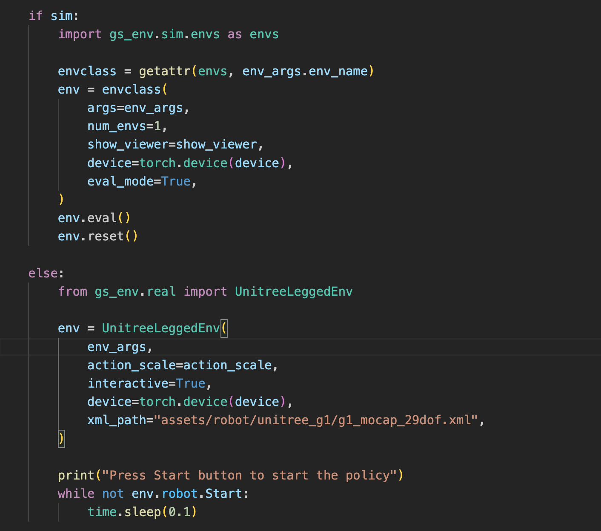
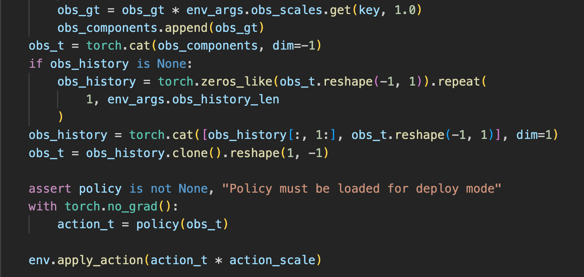
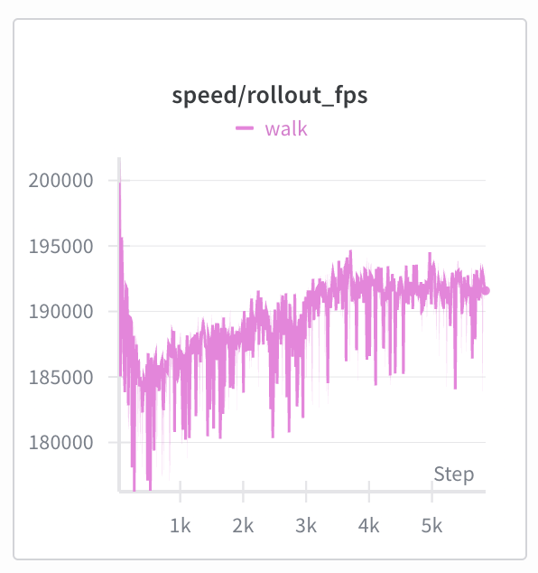

# Genesis Humanoid

**Genesis Humanoid** is an all-in-one humanoid research platform on top of the [Genesis](https://github.com/Genesis-Embodied-AI/Genesis) simulator. It supports real-time human-to-humanoid retargeting, includes different motion dataset with unified format, provides an end-to-end learning pipeline, and offers a modular low-level control testbed for experimentation.

<p align="center">
  
</p>

Genesis Humanoid shares the modular design with [GenesisPlayground](https://github.com/yun-long/GenesisPlayground), featuring with:
- **macOS compatibility** provides an interactive viewer on your MacBook.

<p align="center">
  
</p>

- **Sim-Real duality** enables seamless sim2real deployment with the same code.

<p align="center">
  
</p>
<p align="center">

</p>

- **Extraordinary speed** that reaches **200k RL** steps per second (8192 environments, decimation 4 and 29 articulated joints, tested on a NVIDIA L40s with `run_ppo_walking.py`), which is nearly **0.8M FPS**.

<p align="center">
  
</p>

We list several featured projects built on Genesis Humanoid below:

<table>
<tr>
<td width="200">

<a href="https://github.com/yourname/ExtremControl">
  
</a>

</td>

<td valign="top">

<h3>
  <a href="https://owenowl.github.io/extremcontrol/" style="color: inherit;">
    ExtremControl
  </a>
</h3>

<p>
  A whole-body teleoperation system for Unitree G1 with 
  <strong>50ms end-to-end latency</strong>.
</p>

</td>
</tr>
</table>

## Code Structure

Adopting from [GenesisPlayground](https://github.com/yun-long/GenesisPlayground), Genesis Humanoid is built with:
- `gs-schemas` - Shared data structures and interfaces
- `gs-agent` - Robot learning algorithms (PPO and DAgger)
- `gs-env` - Wrapped environments including both simulation and real world
- `examples` - Ready-to-run examples in simulation
- `deploy` - Ready-to-run examples in the real world

To setup a new simulation environment, write new robot and environment configurations in `src/env/gs_env/sim/robots/config/registry.py` & `src/env/gs_env/sim/envs/config/registry.py`.

## Code Style

We use `pre-commit` to enforce code formatting and linting.

```bash
pre-commit install
pre-commit run --all-files
```

## Installation

### 1. Install Dependencies

<!-- ```bash
# Install uv (fast Python package manager)
curl -LsSf https://astral.sh/uv/install.sh | sh

# Clone and setup the repository
git clone git@
cd GenesisHumanoid
``` -->

### 2. Install the `gs-env` package

```bash
# uv
uv sync --package gs-env

# pip
uv pip compile pyproject.toml -o requirements.txt --python /PATH/TO/PYTHON
pip install -r requirements.txt
```

### 3. Activate the environment

```bash
source .venv/bin/activate
```

### 4. Setup real-world environment

Please refer to READMEs in each folder under `src/env/gs_env/real`.

## Usage

A wide range of example usages of Genesis Humanoid can be found in the `/examples` and `/deploy` directories.

### Process existing motions

```bash
# LAFAN1 (Optional but recommended)
python examples/convert_lafan.py

# HuB (Optional)
python examples/convert_hub.py

# Recorded MoCap motion
python examples/convert_optitrack.py

# AMASS (Optional)
# Download SMPLX body model to assets/body_models
# Download AMASS dataset to assets/AMASS
python examples/convert_amass.py
```

### Run RL training

```bash
# Teleop teacher policy
python examples/run_ppo_motion.py \
    --exp_name TEACHER_EXP_NAME \
    --env_name g1_motion_teacher \
    --env.motion_file assets/motion/motion.yaml
```

### Run BC distillation

```bash
# Distill a deployable policy
python examples/run_bc_motion.py \
    --exp_name BC_EXP_NAME \
    --env_name g1_motion \
    --teacher_exp_name TEACHER_EXP_NAME \
    --env.motion_file assets/motion/motion.yaml
```

### RL finetune / resume training

```bash
# Finetune the distilled policy
python examples/run_ppo_motion.py \
    --exp_name BC_EXP_NAME \
    --env_name g1_motion \
    --resume True \
    --use_stored_config False \
    --runner.freeze_actor_iterations 200 \
    --algo.lr 3e-5 \
    --env.motion_file assets/motion/teacher.yaml
```

### Evaluate trained policy

```bash
# Evaluation will store a deployable policy to deploy/logs/EXP_NAME
python examples/run_ppo_motion.py \
    --exp_name EXP_NAME \
    --num_ckpt NUM_CKPT (optional) \
    --eval True \
    --show_viewer True \
    --env.motion_file assets/motion/evaluate.pkl
```

### Deploy to a real robot

Install [unitree-sdk2-python](https://github.com/unitreerobotics/unitree_sdk2_python) for deployment.
Install [redis](https://github.com/redis/redis) for teleoperation.

```bash
# Make sure deploy/logs/EXP_NAME exists
# Sanity check in simulation
uv pip install redis
python deploy/g1_teleop.py --exp_name EXP_NAME
python deploy/g1_motion.py \
    --exp_name EXP_NAME \
    --motion_file MOTION_PATH

# Deployment should start from small ACTION_SCALE
python deploy/g1_teleop.py \
    --exp_name EXP_NAME \
    --sim False \
    --action_scale ACTION_SCALE
python deploy/g1_motion.py \
    --exp_name EXP_NAME \
    --motion_file MOTION_PATH \
    --sim False \
    --action_scale ACTION_SCALE
```

### Teleoperate the robot

```bash
# Test with existing motion
python deploy/motion_publisher.py --motion_file MOTION_FILE

# Optitrack MoCap
python deploy/optitrack_publisher,py

# SteanVR
python deploy/steamvr_publisher.py
```

## Unified Motion Dataset
The `convert_[ ].py` files convert the existing motions from different format into:
```python
{
    "fps": 50,
    "link_names": ["LINK_NAMES_IN_ORDER"],
    "dof_names": ["DOF_NAMES_IN_ORDER"],
    "pos": torch.Tensor, # [num_frames, 3] position of the root link
    "quat": torch.Tensor, # [num_frames, 4] quaternion of the root link
    "dof_pos": torch.Tensor, # [num_frames, num_dof] dof positions in order
    "link_pos": torch.Tensor, # [num_frames, num_link, 3] link positions in order
    "link_quat": torch.Tensor, # [num_frames, num_link, 4] link quaternions in order
    "foot_contact": torch.Tensor, # [num_frames, 2] foot contact probability
}
```

<!-- ## Citation

If you find our code useful, please consider citing our related paper:
```
``` -->

## Acknowledgement

The entire codebase is built on [GenesisPlayground](https://github.com/yun-long/GenesisPlayground). We thank [GMR](https://github.com/YanjieZe/GMR) for serving as a reference for retargeting and OptiTrack streaming. The human datasets used in this project includes [AMASS](https://amass.is.tue.mpg.de/), [HuB](https://hub-robot.github.io/) and [LAFAN1](https://huggingface.co/datasets/lvhaidong/LAFAN1_Retargeting_Dataset).